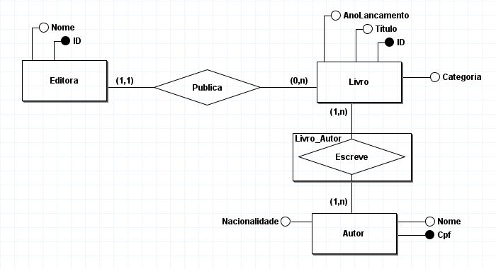
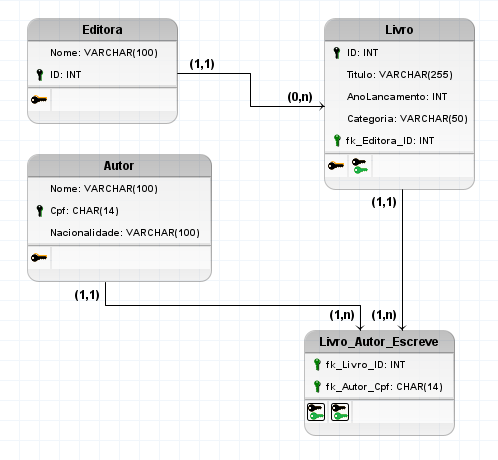

### Modelo Conceitual



### Modelo Lógico



### Modelo Físico

```sql
CREATE TABLE Livro (
    ID INT PRIMARY KEY,
    Titulo VARCHAR(255),
    AnoLancamento INT,
    Categoria VARCHAR(50),
    fk_Editora_ID INT
);

CREATE TABLE Editora (
    Nome VARCHAR(100),
    ID INT PRIMARY KEY
);

CREATE TABLE Autor (
    Nome VARCHAR(100),
    Cpf CHAR(14) PRIMARY KEY,
    Nacionalidade VARCHAR(100)
);

CREATE TABLE Livro_Autor_Escreve (
    fk_Livro_ID INT,
    fk_Autor_Cpf CHAR(14)
);
 
ALTER TABLE Livro ADD CONSTRAINT FK_Livro_2
    FOREIGN KEY (fk_Editora_ID)
    REFERENCES Editora (ID)
    ON DELETE CASCADE;
 
ALTER TABLE Livro_Autor_Escreve ADD CONSTRAINT FK_Livro_Autor_Escreve_1
    FOREIGN KEY (fk_Livro_ID)
    REFERENCES Livro (ID);
 
ALTER TABLE Livro_Autor_Escreve ADD CONSTRAINT FK_Livro_Autor_Escreve_2
    FOREIGN KEY (fk_Autor_Cpf)
    REFERENCES Autor (Cpf);
```